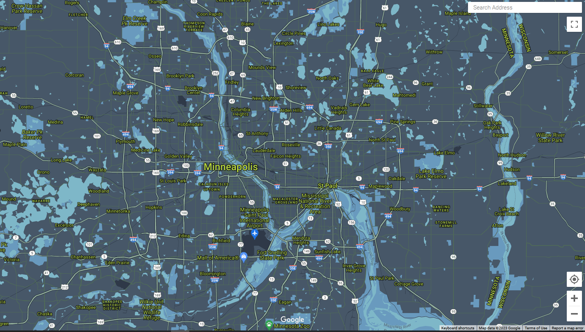
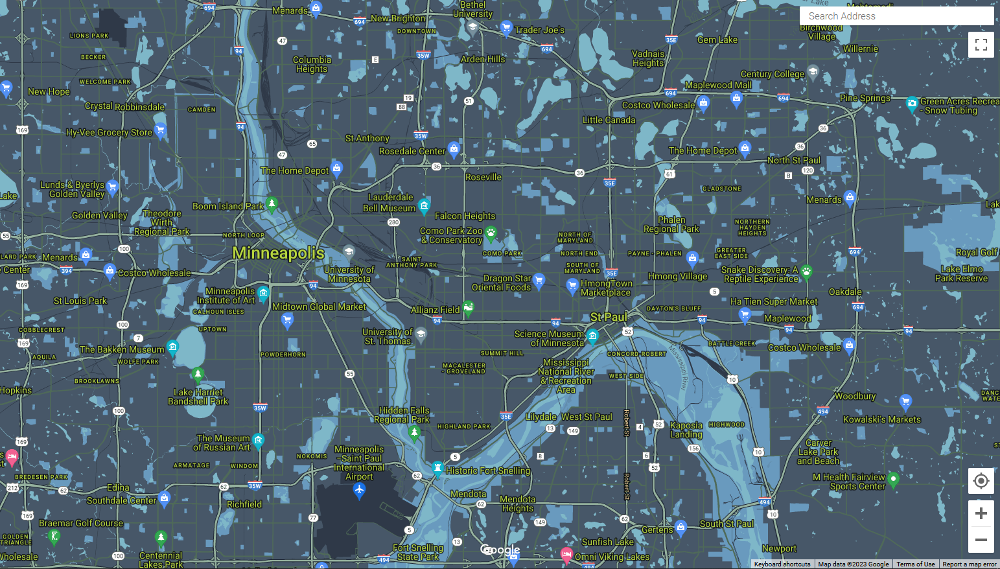
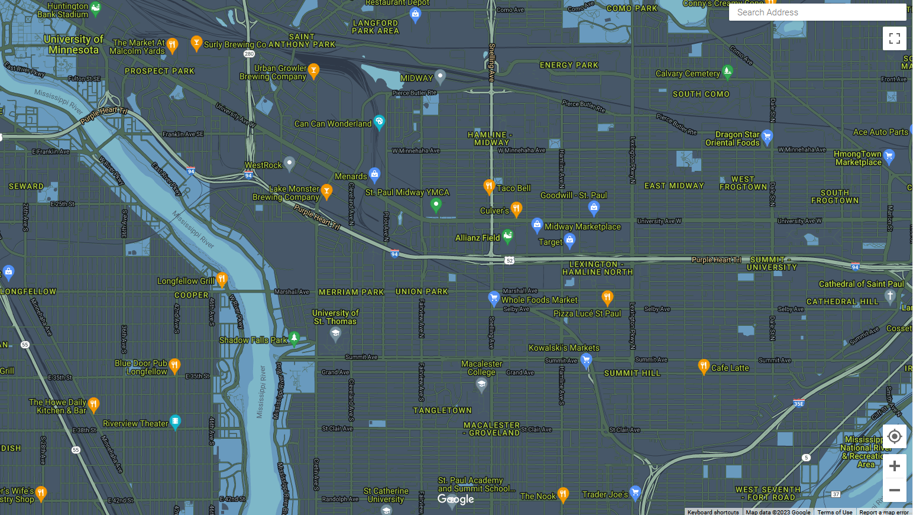

# Google Map for a Non-Profit

I chose to create a map for a non-profit called Project for Pride in Living that is based in Minneapolis and St. Paul, Minnesota. I picked this organization because I volunteered there while I was an undergraduate student and their mission is very important to me. [Here](https://www.ppl-inc.org/) is a link to their website.

[Here](PPL_json.txt) is a link to a text file containing the JSON code for the stylized Google Map.

The bid I created at the beginning of my assginment and my actual hours and reflection can be found [here](PPL_Bid.docx)

## Color Palette

These were the hex codes I used when designing my map:

* Fiord #475768 
* Conifer #B6D43E 
* Glacier #7EB7C8 
* Cerulean Frost #699BBE 
* Envy #95B19E 

The envy color itself was never used, but I used the color as a baseline for finding a lighter and darker shade of the color. These shades were used for the road (#bfd0c5) and highway (#4f6a58) geometry. I also utilized black, dark blue, and grey as complementing shades. These were primarily used for text outlines and text fills for roads and bodies of water.

## Map

This is the most zoomed out screenshot:

A screenshot a little more zoomed in:

The most zoomed in screenshot:

## Look Up Table

| Feature                 | Element             | Styler                   | 
|-------------------------|---------------------|--------------------------|
| All                     | Geometry            | Fiord (#475768)          |
| All                     | Labels/Text fill    | Conifer (#B6D43E)        |
| All                     | Labels/Text outline | Black (#00000)           |
| Administrative/Locality | Labels/Text fill    | Conifer (#B6D43E)        |
| Administrative/Locality | Labels/Text outline | Black (#00000)           |
| Points of interest      | Labels/Text fill    | Conifer (#B6D43E)        |
| Points of interest      | Labels/Text outline | Black (#00000)           |
| Points of interest/Park | Geometry            | Cerulean Frost (#699BBE) |
| Points of interest/Park | Labels/Text fill    | Conifer (#B6D43E)        |
| Points of interest/Park | Labels/Text outline | Black (#00000)           |
| Road                    | Geometry            | Mineral Green (#4F6A58)  |
| Road                    | Stroke              | Dark Cyan Blue (#212A37) |
| Road                    | Text fill           | Gray (#9CA5B3)           |
| Road/Highway            | Geometry            | Sage Green (#95B19E)     |
| Road/Highway            | Stroke              | Dark Blue (#1F2835)      |
| Road/Highway            | Text fill           | Vespa Yellow (#F3D19C)   |
| Transit                 | Geometry            | Dark Cyan Blue (#2F3948) |
| Transit/Station         | Text fill           | Conifer (#B6D43E)        |
| Water                   | Geometry            | Glacier #7EB7C8          |
| Water                   | Text fill           | Gray Blue (#515C6D)      |
| Water                   | Text outline        | Black (#00000)

## Design Decisions

* I decided to apply the fiord color to the land geometry as a lot of PPL's graphics used this color as the background. 
* I applied the conifer color to the text fields because I felt like it popped well against the land color.
* I used ship cove as the park geometry color and glacier as the water geometry color. At first I had these flipped, as ship cove is a little more blue and I thought that would look nice as the water. However, when I tried this I did not like how it looked. So I flipped these colors and liked that much more.
* I first used envy as the color for all of the road geometry (roads and highways). However, this looked very busy and you could not easily differentiate major roads from smaller ones. So I decided to use envy as a baseline for two different colors for roads and highways. Roads got a darker shade (#bfd0c5) because it blended into the dark blue land geometry better. Highways got a ligher shade (#4f6a58) to stand out from the land geometry more.

## Process 
1. I started by creating a bid for this work. I focused on the time it would take to explore the website and find a good color palette and then the time it would take for me to build the map in Google Map's Styling Wizard.
2. I then explored the PPL website until I found a few good photos that I thought would help me create a color palette. I screenshotted these images and uploaded them to canva's color paletter generator. From these color palettes I chose my final colors.
3. I then found the RBG codes for the hex codes canva provided to me. I used Adobe Color to do this.
4. From here I started playing with the Styling Wizard. I chose to start with the night theme.
5. I then starting applying colors to the land mass, large text, and bodies of water first to get a sense of the feel, and then iterated until I found a color combination I liked. 
6. Once I found a general color scheme I liked I applied that scheme to the smaller texts fields and found two shades of the same colorfor the roads and highways.
